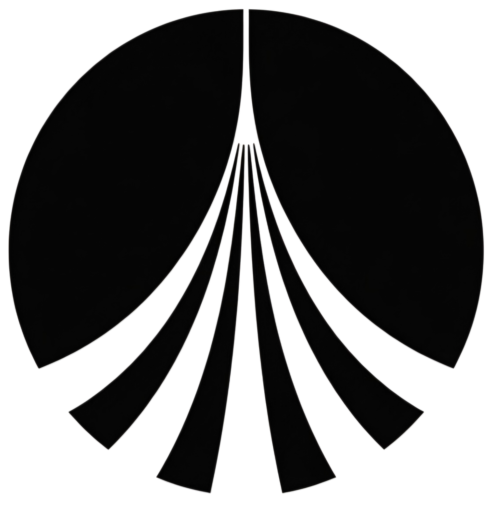

  

<h1 align="center">Concord</h1>

  
  
  

Concord is a runtime and control layer for running software across machine
fleets in environments with poor connectivity and conditions that degrade
electronics and communication, such as space, remote terrain,
underground sites, or the sea. Concord is built for clusters that segment,
keep operating locally, and meet again later.

Concord is designed for mathematical consistency. Each segment can keep
operating from local knowledge, and when segments meet again their state
is reconciled by explicit rules instead of a hidden central truth.

## What Concord Is For

- Machine fleets that cannot depend on continuous connectivity
- Remote systems where communication degrades or disappears
- Software that must keep running during cluster segmentation
- Operators who need local operation and later reconciliation

## Formal Verification

- The design of important system parts is fully formally verified.

## Kubernetes Compatibility

Concord is not standard Kubernetes. It may support Kubernetes-like
deployment workflows, but it does not promise a coherent cluster
network, a central control plane, or one always-current source of truth.
If your software needs one live global truth, Concord is the wrong place to
run it. Cluster segmentation is expected. Local operation and later
reconciliation are part of the model.

## TODO

- [ ] DNS state reconciliation between nodes + what happens when a bubble/segment reconnects. But the problem is connected, if we implement that, we have to implement reconcilliation for EVERYTHING at once. That is why this comes last.
- [ ] Peer sync catch-up for long journals (not needed for current stub/mesh path; do after real journal pull/apply works):

  | Piece | Role |
  | --- | --- |
  | Persist watermarks | Restart resumes mid-history, not from year 0 |
  | Paging (`Limit`) | Already in pull loop — never one unbounded dump |
  | Optional: snapshots | State as of T + events after T (later) |
  | Idempotent apply | Replay after restart does not corrupt (event id) |

- [ ] Extension friendliness (after real journal sync; core is solid but not plugin-first yet):

  | Gap | Effect |
  | --- | --- |
  | Runtime is one hard-wired `Run()` | No registry of “start these services” |
  | Sync handler stub inside `transport` | No pluggable sync backend / apply pipeline |
  | Pull loop watermarks only in RAM | No store interface for durable cursors |
  | Event types are free strings | No typed extension catalog |
  | No SDK / extension API surface | External code cannot hang off lifecycle cleanly |
  | Tight package coupling via runtime | Hard to ship optional modules |

## Documentation

- [Commit message format](./COMMITS)
- [Contributor license agreement](./CLA)

## Supported IDEs

We support [Zed](https://zed.dev/). We do not support any other IDEs at
the moment.

## License

Concord is distributed under the GNU Affero General Public License v3.0 or
later. See [LICENSE](./LICENSE).
