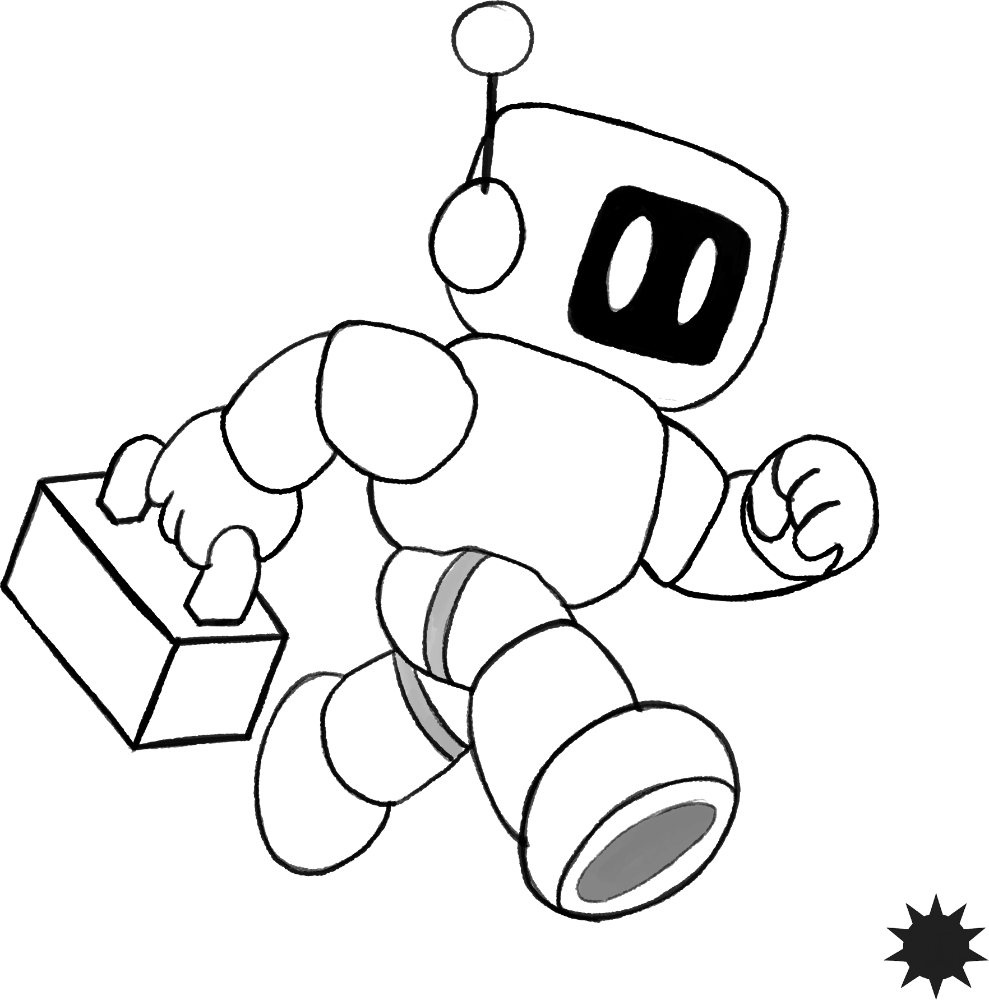

  

<h1 align="center">Concord</h1>

  
  

Concord is a runtime for machine fleets that lose their network and keep
running. Built for space, sea, remote terrain, and underground. Places where
clusters segment, operate locally, and reunite later.

Concord is designed for mathematical consistency. Each segment can keep
operating from local knowledge, and when segments meet again their state
is reconciled by explicit rules instead of a hidden central truth.

Concord is a fleet brain, not a real-time controller. Motor loops, collision
avoidance, and sensor fusion run at the edge, below Concord's reach. Concord
coordinates the fleet; it does not pilot the machine.

### Kubernetes Compatibility

**Concord is not standard Kubernetes.** It may support Kubernetes-like
deployment workflows, but it does not promise a coherent cluster
network, a central control plane, or one always-current source of truth.
**If your software needs one live global truth, Concord is the wrong place to
run it.** Cluster segmentation is expected. Local operation and eventual consistency are part of the model.

### Documentation

- [Roadmap](./TODO.md)
- [Tradeoffs](./TRADEOFFS.md)
- [Commit message format](./COMMITS)
- [Contributor license agreement](./CLA)

### License

Concord is distributed under the GNU Affero General Public License v3.0 or
later. See [LICENSE](./LICENSE).
